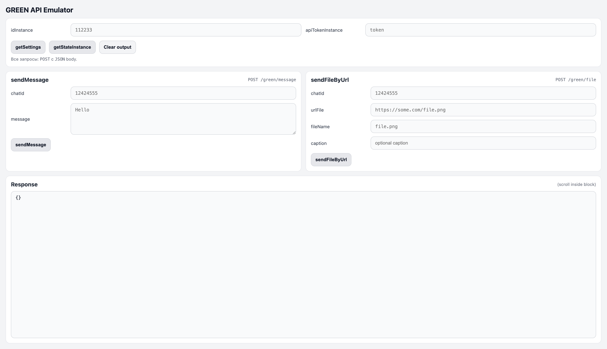
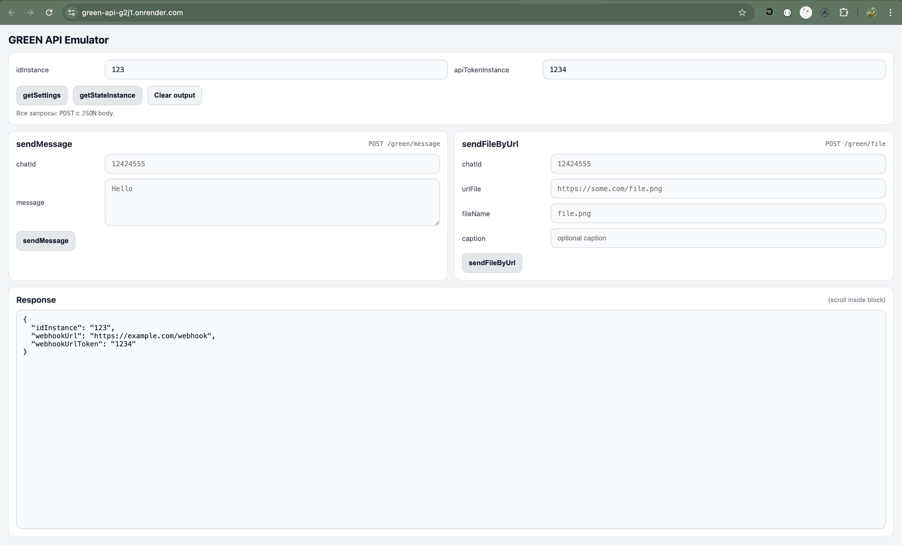
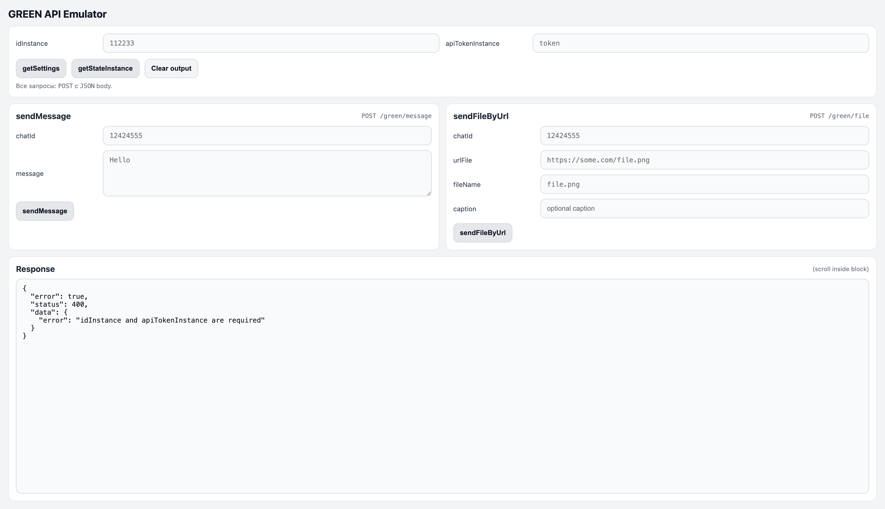
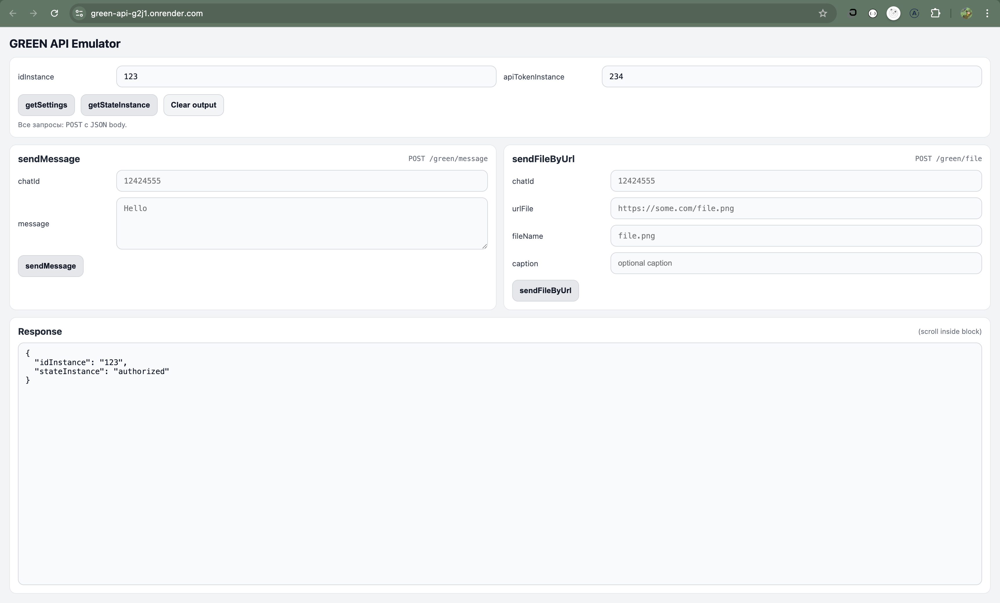
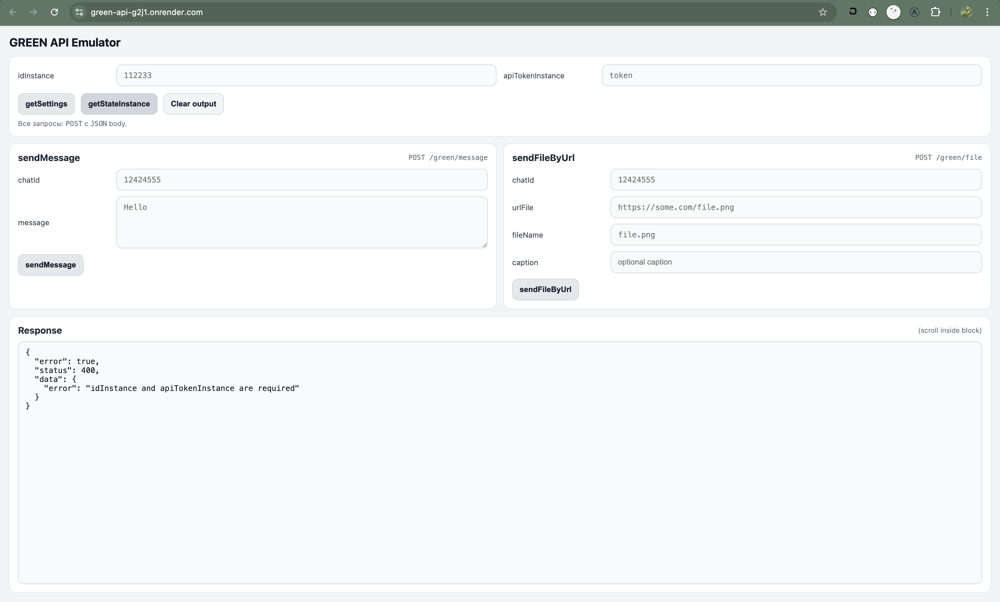
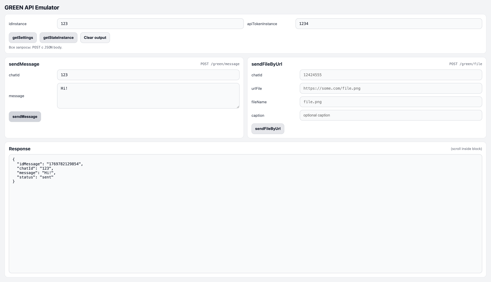
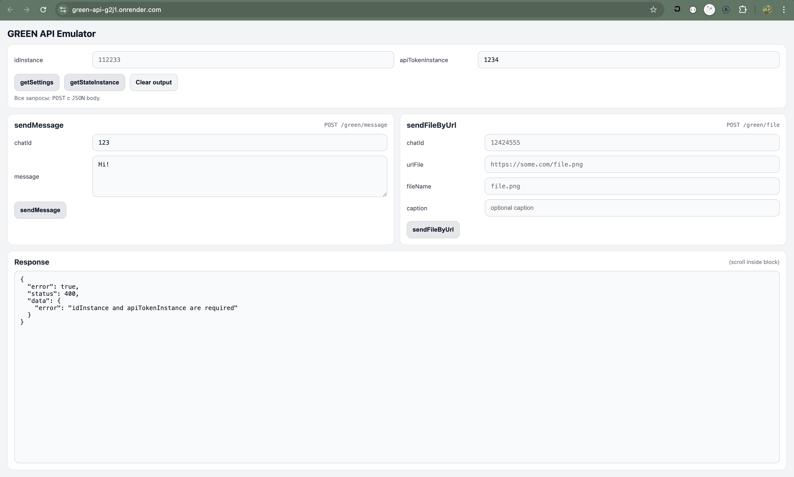
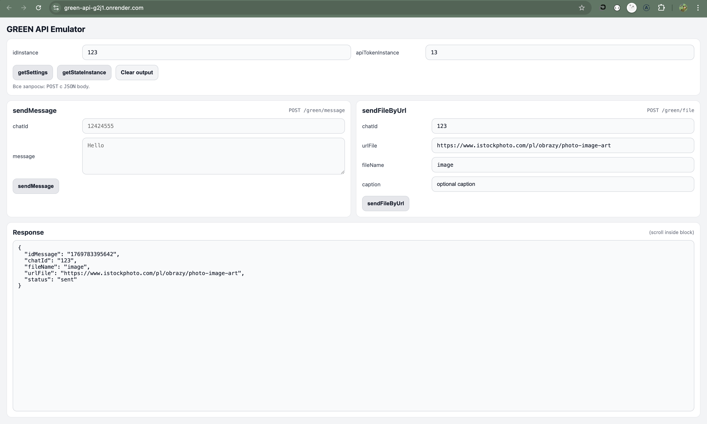
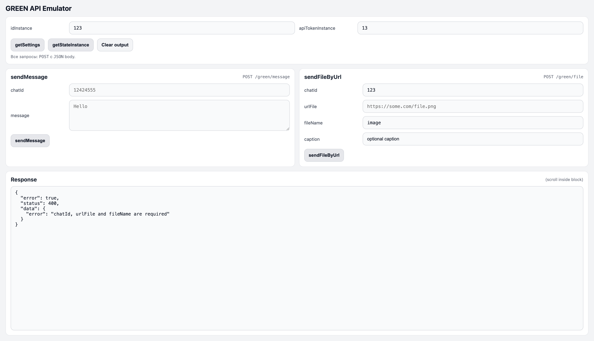

# GREEN API Emulator

## Пример работы

### Страница с незаполненными данными

---

## Результаты работы функции `getSettings`

---

## Результаты работы функции `getStateInstance`

---

## Результаты работы функции `sendMessage`

---

## Результаты работы функции `sendFileByUrl`

